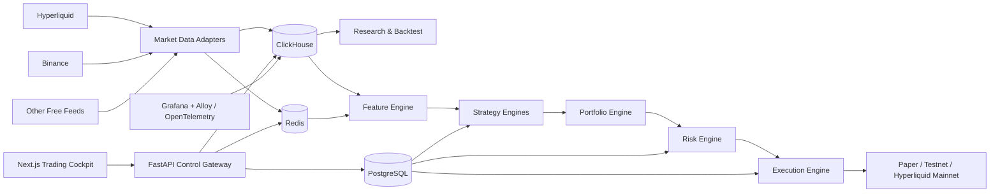
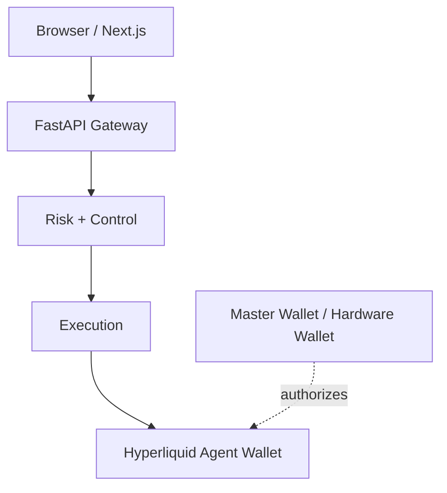

# Architecture

## Overview



## Separation of concerns

### Data Plane
Owns collection, timestamping, normalization, quality checks and storage. Strategy code never calls vendor-specific APIs directly.

Canonical interfaces should expose concepts such as:

```text
MarketData.price(symbol)
MarketData.orderbook(symbol)
MarketData.funding(symbol)
MarketData.open_interest(symbol)
MarketData.trades(symbol)
```

Adapters initially target Hyperliquid and Binance, with additional free venues added only where they serve a research hypothesis.

### Research Plane
Runs isolated experiments and may consume significant CPU/RAM without affecting the live trading process. It contains feature research, event-driven backtesting, walk-forward validation, Monte Carlo/stress tests and an experiment registry.

### Trading Plane
Small, deterministic and continuously available. It consists of:

- live feature calculation;
- strategy engines;
- portfolio construction;
- risk engine;
- execution engine;
- account reconciliation.

No research job may share failure fate with the trading process.

### Control Plane
FastAPI + PostgreSQL manage configuration and lifecycle state, including:

- active strategy versions;
- allocations;
- risk limits;
- trading mode;
- experiment/promotion status;
- operator actions;
- audit history.

### Observability Plane
Grafana and OpenTelemetry/Grafana Alloy expose metrics, logs, traces, alerts and forensic timelines. Observability has read access to trading analytics and must not become a path to sign orders.

## Data stores

### ClickHouse
Use for append-heavy analytical/time-series data:

- raw and normalized trades;
- candles;
- L2 snapshots/derived depth;
- funding and OI;
- features and predictions;
- signals;
- fills and execution analytics;
- PnL/equity snapshots;
- backtest results.

### PostgreSQL
Use for durable transactional/configuration state:

- strategy registry and versions;
- model metadata;
- risk policies;
- portfolio allocation;
- deployment state;
- experiment metadata;
- approvals and audit records.

### Redis
Use as a bounded realtime nervous system, not as the system of record:

- current market state;
- signal state;
- order/position cache;
- health state;
- lightweight streams/events.

Redis must have memory limits and persistence choices appropriate to disposable realtime state.

## Backend / frontend boundary

The browser communicates only with the FastAPI control gateway over HTTPS/WebSocket. The UI never contains exchange signing keys and never signs Hyperliquid orders directly.



## Execution modes

All modes implement one broker/execution interface:

- `BACKTEST`
- `PAPER`
- `SHADOW`
- `TESTNET`
- `LIVE`

Strategy and risk code must not branch into separate logic just because the broker changes. This is central to avoiding paper/live drift.

## Planned service layout

```text
apps/
  cockpit/
  api/
  collector/
  trader/
  research-worker/
quant/
  strategies/
  features/
  portfolio/
  risk/
  execution/
  backtest/
  validation/
data/
  adapters/
  schemas/
infra/
  docker/
  clickhouse/
  postgres/
  redis/
  grafana/
  alloy/
```

## Performance philosophy

Python is the default trading/research language because the first strategies operate over seconds-to-days rather than microseconds. If profiling later proves a latency-sensitive path has meaningful economic value, that isolated collector/execution component may be replaced with Rust without changing strategy APIs.

## Reliability requirements

The production execution path must eventually support:

- deterministic client order IDs;
- idempotent order submission handling;
- partial fills;
- cancel/replace state machines;
- stale-data guards;
- reconnect + resubscription;
- periodic account/position reconciliation;
- persisted execution ledger;
- startup recovery;
- maximum spread/slippage guards;
- global halt and flatten controls;
- dead-man/cancel-all protection;
- separate agent wallet(s) from the master wallet.