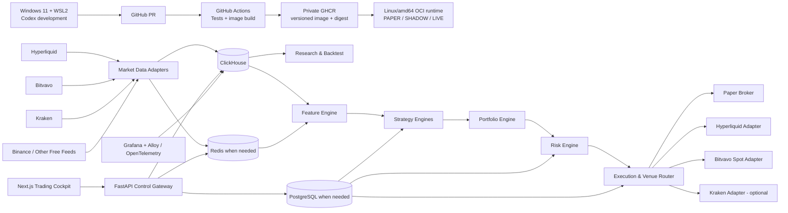
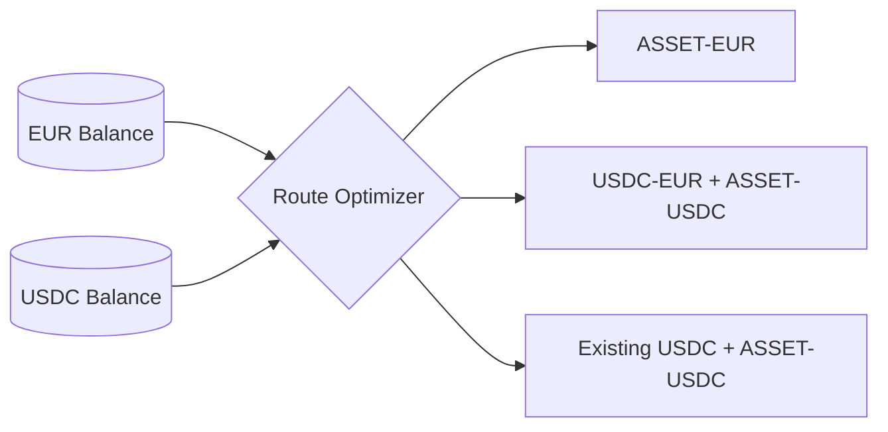
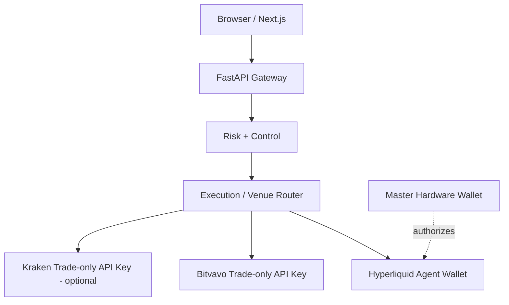

# Architecture

## Overview

The platform follows two governing principles:

> **Observe many venues; trade on few venues.**

> **Develop away from the 24/7 runtime; deploy tested immutable artifacts.**

The data plane may ingest multiple free public feeds, while authenticated execution is introduced gradually and only where it has a measurable purpose. Source development happens on Windows 11 through WSL2 and Codex. The runtime boundary is host-neutral Linux/amd64 OCI and consumes pinned images; a supported Ubuntu LTS VPS is the intended primary deployment profile, while TrueNAS remains an optional existing profile.



See [Development Workflow](DEVELOPMENT.md), [Deployment](DEPLOYMENT.md), and [Venue Strategy](VENUES.md).

## COURSE-1 delivery cut line

The long-term platform shape above remains directional, but it is not the current implementation
sequence. The repository has a working public-trade decoder and collector plus extensive dormant
provenance contracts, but no end-to-end replay, strategy, risk, PAPER execution or order/fill
ledger route. The next product proof therefore uses one reuse-first vertical slice:

```text
bounded Hyperliquid BTC-PERP replay + identified run configuration
  -> one deterministic, non-promotable smoke strategy
  -> pre-trade risk decision and hard exposure cap
  -> PAPER execution with explicit fee/funding/spread/slippage assumptions
  -> orders, fills, position, PnL and reconstructable run artifacts
  -> the same downstream strategy/risk/PAPER path on live public data
```

This is an engineering route test, not evidence of alpha and not strategy promotion to `PAPER`.
It requires no exchange credential and cannot submit a venue order. `TESTNET` remains a separate,
authenticated environment and is not another spelling of PAPER.

The slice is deliberately narrow:

- one Hyperliquid BTC perpetual instrument;
- one bounded replay representation at the minimum granularity needed by the chosen fill model;
- one direct mapping from existing data into the selected engine, with no speculative framework
  abstraction;
- one process and local files where sufficient;
- no ClickHouse, Redis, PostgreSQL, FastAPI, cockpit, Grafana or 24/7 deployment dependency;
- schema v2 may remain the active project boundary; the dormant v3 envelope is not activated.

Before implementing another backtester, paper broker, order-management system or reconciliation
framework, a short fit gate evaluates an existing engine against these exact needs. NautilusTrader
is the primary candidate because it is designed around one strategy model across historical,
sandbox and live contexts and has a Hyperliquid adapter. That is a candidate hypothesis, not an
adoption decision. The gate must verify, rather than assume:

- an exactly pinned, supportable version and acceptable LGPL-3.0 obligations;
- deterministic BTC-PERP replay and a credentialless public-data-to-sandbox PAPER composition;
- explicit fail-closed environment selection, because missing configuration must never default
  this project into a venue execution environment;
- required precision, funding, order/fill/position and correlation semantics;
- restart, persistence and reconciliation boundaries, including what remains project-owned;
- the data granularity and fill-model limits behind every result.

The official Hyperliquid Python SDK and API documentation are protocol, signing, asset-ID and
precision references; the SDK is not a backtester or trading engine. Hummingbot remains a possible
specialized connector/execution candidate, not a second platform core. Freqtrade may be useful as
a strategy comparator or disposable prototype, but its bot lifecycle is not the platform kernel.
A thin native implementation is the fallback only if the fit gate identifies a smaller, explicit
gap than adopting a framework would create.

COURSE-1 defers Phase 1A-3B1C-2, 3B1C-3, 3B1D and the provenance-complete form of 3B2. Existing
code, tests and ADR-022 remain intact and dormant. Reactivation needs a concrete consumer and a
new priority decision after the vertical slice; sunk implementation cost is not itself a consumer.

The local slice precedes runtime-host work. Host-neutral Linux/amd64 OCI is the architecture
boundary and a supported Ubuntu LTS VPS is the intended primary deployment profile. The factual
VPS migration and definitive runtime ADR follow only after the local slice passes. TrueNAS remains
an optional existing profile; this course correction neither migrates nor removes existing
TrueNAS, ClickHouse or Grafana state.

## Environment separation

### DEV — Windows 11 + WSL2

Owns:

- source code;
- Codex-driven implementation;
- unit tests;
- local disposable integration services;
- small deterministic datasets and replay fixtures;
- frontend development;
- small/medium research experiments.

DEV does not own 24/7 state and does not contain production trading credentials.

### CI — GitHub Actions

Owns independent verification and release construction:

- lint/type/test checks;
- frontend production build;
- contract and safety tests;
- container build;
- secret/dependency/security checks;
- release image publication to private GHCR.

CI does not directly promote a strategy into live capital.

### PAPER / SHADOW / LIVE — host-neutral Linux/OCI runtime

Owns:

- continuous market-data collection;
- durable ClickHouse data;
- paper/shadow/live strategy processes;
- operational state;
- Grafana and production cockpit;
- runtime secrets;
- monitoring, alerts, recovery and backups.

These are separately configured deployments. The intended primary profile is a supported Ubuntu
LTS VPS; the existing TrueNAS environment is optional. Provisioning and migration wait for the
local vertical-slice exit gate and the definitive runtime ADR. Source code is never edited in
place inside running containers.

## Separation of concerns

### Data Plane

Owns collection, timestamping, normalization, quality checks and storage. Strategy code never calls vendor-specific APIs directly.

Canonical interfaces should expose concepts such as:

```text
MarketData.price(instrument)
MarketData.orderbook(instrument)
MarketData.funding(instrument)
MarketData.open_interest(instrument)
MarketData.trades(instrument)
MarketData.venue_health(venue)
```

Initial public adapters target Hyperliquid, Bitvavo, Kraken and selected Binance feeds. Additional venues are added only where they serve a research hypothesis or resilience requirement.

The local development data plane uses mocks, fixtures and disposable services. The selected durable runtime store is authoritative for self-collected 24/7 history; existing TrueNAS/ClickHouse state remains protected until an approved migration exists.

#### Dormant provenance spine and atomic v3 cutover

Phase 1A-3B1A defines pure, frozen contracts for feed products, collection/subscription identity,
raw application-message records, point-in-time instrument metadata, explicit coverage, event
families and a provenance-complete `MarketEventEnvelopeV3`. These v3 contracts are defined and
tested but dormant. Their import direction is
`contracts.py <- data_provenance.py <- instrument_metadata.py <- market_event_v3.py`. No runtime
producer constructs or emits `MarketEventEnvelopeV3`, and schema v2 remains the only active Silver
envelope.

The eventual storage-neutral responsibilities are:

- Bronze preserves exact post-extension, reassembled application-message bytes and immutable
  capture lineage without requiring successful decoding;
- Silver contains validated venue-neutral event families with Bronze observation lineage, source
  provenance, resolved point-in-time metadata and ingress/normalization coverage;
- Gold contains reproducible point-in-time features and aggregates derived from identified Silver
  inputs.

Phase 1A-3B1B activates this Bronze boundary only in the Hyperliquid public-trades collector.
Every application message successfully returned by `recv()` is represented once with exact TEXT
or BINARY application-message bytes and accepted by a mandatory bounded `RawRecordSink` before
routing or parsing. A separate mandatory bounded `NormalizationOutcomeSink` then accepts exactly
one frame decision before acknowledgement, pong, deduplication, ordinary message counters or the
existing v2 queue can become visible. The raw-acceptance counter advances immediately after the raw
acceptance echo is verified; the outcome-acceptance counter advances independently after its echo
is verified, with `outcome <= raw` at all times. Those two telemetry mutations are the only state
changes allowed at their respective pre-commit boundaries. Acceptance transfers ownership of the
complete immutable value at the sink boundary; it is not a durability claim. The collector owns
the two distinct sinks for one run and closes the outcome sink before the raw sink, with both
closes bounded and attempted at most once.

Internal constructor and sink exceptions and their traceback frames remain private implementation
details. Standalone module-level producer and consumer coroutine boundaries catch and classify
private failures, release the payload-bearing coroutine graph, and only then create a fresh bounded
public error. Their library traceback frames therefore retain no collector, connection, sink,
queue or payload-bearing state; nothing logs or retains `exc_info`. A sink deadline is a collector
fail-stop decision that does not await child-cancellation completion. A late result is invalid,
ignored and privately consumed. In-process sinks must nevertheless cooperate with cancellation:
Python cannot forcibly terminate hostile coroutine code, so an absolute kill boundary requires a
future isolated worker or process. There is still no concrete storage, operational coverage
tracker, delivery linearization/composite queue item or deterministic replay. A normalization
outcome may therefore be committed even when later v2 queue publication times out; 3B1C-1 defines
only the pure delivery-knowledge and coverage-commit contracts, while 3B1C-2 and 3B1C-3 add their
separate runtime boundaries. Only 3B1D atomically moves both normalizers and the collector
to the mandatory v3 envelope and removes outer v2 plus `is_gap`. No dual writer or permanent v2
wrapper is planned. Nothing is deployed, and SHADOW/LIVE remain disabled. ADR-022 records the
complete decision and canonical identity rules.

The 3B1C audit split that work into reviewable contract, coverage-runtime and delivery phases, with
3B1C-1A through 3B1C-1G as bounded pure corrections before runtime activation. Phase 1A-3B1C-1
defines only pure,
dormant contracts that make coverage initialization, prepared multi-scope compare-and-swap
mutation, repeated-degradation no-ops, frame-atomic abort lineage and destination-specific delivery
knowledge exactly representable. A prepared coverage mutation is not committed state;
`CoverageCommitAcceptance` is the separate proof that its complete resulting state-reference set
was accepted atomically. A prepared state reference is only a candidate token; downstream
provenance uses `CommittedCoverageState`, which binds that token to an acceptance whose complete
result set contains it. Cause-specific fan-out also binds the exact connection session and selected
subscription attempts; evidence from another session in the same run is invalid. A raw-backed
mutation additionally requires a content-addressed binding to the raw record's full-record digest
and complete attempt-status snapshot, which must reproduce the same fan-out exactly. Strict typed
outcomes require their indexed or pre-index scope bindings to carry that identical full-record
digest, rather than accepting only the lower raw-record locator.

Phase 1A-3B1C-1A closes two additional pure runtime-binding gaps without activating coverage.
Acknowledgement fan-out retains the complete current attempt snapshot but requires an explicit
non-empty, sorted and unique selection of attempts that are currently `ACKNOWLEDGED`; only all
plan-derived leaves for those selected specs enter the initialization batch. The proof validates
current state and selection, not the historical ACK transition; earlier ACKs are excluded only when
the caller leaves them unselected. Post-outcome sink failure has one
typed source row binding the exact `NormalizationOutcomeId` and exact Silver-normalization scope.
An explicit typed rejection is definite and maps to `CONFIRMED_INCOMPLETE`; timeout, arbitrary
failure or an invalid acceptance echo leaves acceptance `UNCERTAIN`. Cancellation creates neither
kind of evidence. This evidence is causally later than the attempted outcome and can never be
inserted into that same outcome's prepared lineage. Indexed outcome statuses use exact routed
fan-out; `rejected_before_indexing` uses the complete possibly-active slice. Control/no-event and
valid-empty outcomes cannot create a coverage mutation through this evidence path. Every permitted
case requires the exact raw fan-out binding. The lower evidence row and prepared mutation are not
by themselves proof that the selected fan-out belongs to the concrete decoded outcome.
`NormalizationOutcomeSinkFailureCoverageBinding` is the sole dormant aggregate that checks that
relationship: it binds the concrete outcome, complete prepared batch, raw fan-out binding, exact
decoded scope/attempt union (or exact pre-index aggregate), and one failure-knowledge kind. It
accepts initializations, transitions and already-degraded no-ops only when every target is decided
exactly once. Phase 1A-3B1C-2 must consume this aggregate rather than a loose lower-layer batch or
evidence source. For a genuinely pre-index, family-filtered failure, the fan-out retains the full
possibly-active attempt population from the raw snapshot while its target scopes contain only the
matching family/version/payload slice. This is aggregate uncertainty, not a claim that every
retained attempt produced that event family.

`EventCoverage` requires one collector run and exact committed Bronze provenance for an
upstream-derived Silver state. Phase 1A-3B1C-2 will own the operational coverage state and temporary
lossy v2 `is_gap` projection. Phase 1A-3B1C-3 will bind one non-empty normalization outcome to one
audited output-queue delivery item. Neither later runtime step is implemented by 3B1C-1.

Repeated evidence for a scope already at or beyond the required degraded state retains the exact
current state reference and transition ordinal. It is represented as a prepared no-op beside the
new typed evidence instead of manufacturing a transition; its bounded initial reason, transition
reason and evidence kind must still describe one exact cause. Delivery knowledge is closed and
separate from event coverage: accepted, definitely not accepted, or acceptance uncertain. Queue
acceptance means only acceptance by the bounded collector output queue, not dequeue, consumer
processing or durable persistence. Existing 3B1B capture remains transition-empty, schema v2 and
`is_gap` remain active, and `MarketEventEnvelopeV3` plus `NormalizationContext` remain dormant.
The active collector does not yet construct either new 3B1C-1A contract path; that remains
Phase 1A-3B1C-2 work.

Phase 1A-3B1C-1B closes one further pure binding gap for reliably indexed trades observed before
their exact subscription attempt was acknowledged. A separate rejection-only route accepts only
the Bronze-captured `PENDING`, `SEND_STARTED` or `SENT` snapshot and binds the feed, session, spec,
attempt, capture status, public selector, canonical instrument and trade-family binding to one exact
Silver-normalization leaf. It cannot materialize an event or initialize complete coverage. Its only
direct mutation is an indexed `REJECTED` / `PROVENANCE_MISMATCH` decision with typed
`PROVENANCE_MISMATCH` failure evidence and `CONFIRMED_INCOMPLETE` Silver coverage. One unique route
may explain multiple separately indexed evidence rows for the same scope; every index still resolves
to exactly one route and retains its own raw index and source identity. Otherwise-valid acknowledged
peers retain only frame-atomic-abort evidence, and duplicates create no coverage loss. A separate
mixed proof form is available only where post-outcome sink failure must bind the complete exact
non-ACK/ACK scope and attempt union. Both forms are rederived from the immutable raw attempt snapshot.
The existing acknowledged `exact-routed-events-v1` identities and active runtime remain unchanged;
3B1C-1B is dormant until 3B1C-2 consumes it.

Phase 1A-3B1C-1C closes a boundedness blocker found by that future runtime integration. The v1
mutation content repeats complete nested ID lists: 957 targets measure 16,762,723 characters under
the 16,777,216-character limit, while 958 valid targets already fail; a 300-target historical
`COMPLETE -> UNCERTAIN` mutation reaches 11,824,581 characters. Increasing the limit would only
move the failure, while chunking would break the one-batch atomic CAS rule. New factories therefore
emit `CoverageMutationBatch` v2 and `CoverageCommitAcceptance` v2. Their top-level canonical content
uses ordered, domain-separated SHA-256 commitments that bind target/result ordinal, cardinality and
every exact retained typed value. The full pre-state, initialization, transition, no-op and result
tuples remain available and are rehashed during stored verification. The same audit proved that
plan-wide normalization lineage needed compact representation, so new factories emit lineage v3
with one ordered commitment per complete typed role. Legacy batch/acceptance v1 and lineage v2 IDs
remain byte-exact parser-only forms and cannot cross-bind to the new versions. The representation
still describes one indivisible operation; it adds no chunking, partial acceptance, runtime state
or recovery. This correction is dormant, and 3B1C-2 resumes only after it is merged.

Phase 1A-3B1C-1D closes two further contract blockers found by the protected runtime probe. First,
one indexed frame can contain both an independently rejected item and a source-event conflict.
Choosing either older frame status would discard one primary cause, so the closed
`MIXED_INDEXED_FAILURE` matrix requires at least one of each, permits only rejected, conflicting,
frame-aborted and exact-duplicate indexes, and commits no materialization. New outcome factories
write `normalization-outcome-v2`; v1 remains parser-only and cannot encode the mixed status. The
raw-event and outcome-content layouts remain unchanged.

Second, deriving each committed leaf independently reparsed the same complete plan-wide acceptance
and lineage. A 1,000-spec probe spent 47.808 seconds in commit and approximately 53.189 seconds
overall, with about 335.7 million calls and 2.06 million canonical JSON parses. The sealed
`BatchVerifiedCoverageDerivation` now verifies one exact batch-v2, acceptance-v2 and ordered result
set once in O(N), derives the ordinary committed-state and upstream-source values once, and exposes
O(1) indexed access without introducing alternate IDs, a cache or another commit proof. The later
3B1C-2 integration must additionally satisfy the synchronous CPU budget `C`:

```text
max(H, P + 2 * (R + O + C) + Q) + (R + O + C + Q) + S < 60 seconds
```

Defaults `H=45`, `P=10`, `R=1`, `O=1`, `C=1`, `Q=5` and `S=4` produce exactly 57 seconds. This
contract correction adds no coverage runtime or delivery linearization; schema v2 and `is_gap`
remain active, and `MarketEventEnvelopeV3` remains dormant.

Phase 1A-3B1C-1E closes the remaining synchronous cost inside that unchanged bulk boundary. The
1D implementation was linear but repeatedly parsed and serialized nested scope, epoch, evidence,
state and acceptance identities; its historical warm 1,024-target median was 1.148715 seconds and
could not leave an honest runtime reserve inside `C=1`. The factory now creates one call-local
verification transcript, rederives each typed state chain and stored commitment once, and reuses
those immutable facts for result membership and leaf derivation. It adds no global or cross-call
cache, verification flag or alternate identity. On the pinned TerraPC fixture, full warm
`from_commit` medians at 1,024 targets were 0.283136466 seconds for initialization, 0.569355146
seconds for `COMPLETE -> UNCERTAIN`, and 0.707791138 seconds for a full no-op; maxima were
0.302709014, 0.587829245 and 0.723139806 seconds. The 512-to-1,024 median ratios were 1.904129008,
1.916039095 and 1.885200742. Fixtures and acceptances were built before timing, three warmups were
discarded, nine sequential full calls were measured with garbage collection enabled, and no sample
was removed. ADR-022 retains the complete ordered sample ledger. These host- and fixture-bound
measurements satisfy the pure 0.8-second `from_commit` allocation but are not a worst-case
guarantee. The remaining 0.2 seconds is a binding allocation for 3B1C-2, not evidence that its
current Bronze-to-Silver path fits: a separate diagnostic serial construction of 1,024 ordinary
upstream evidence values took 18.257364 seconds (about 739 canonical parses per leaf). That path
must be optimized or receive a separate contract closure before 3B1C-2 may claim its complete
synchronous median is at most 1.0 second; the runtime gate is not relaxed. Canonical bytes, IDs,
versions and coverage semantics are unchanged. The phase remains pure and dormant.

Phase 1A-3B1C-1F makes each newly written fan-out proof self-contained. Every active fan-out
factory writes `coverage-fanout-proof-v3` and retains the exact typed `CoverageTargetCatalog`; the
catalog already retains its complete typed `SubscriptionPlanIdentity`, so the plan is not copied a
second time. Stored verification reconstructs the plan, catalog, connection session,
kind-specific source row, selected attempts and exact target slice before rederiving the compact v3
content digest and ID. Historical v1/v2 proof IDs remain parser-only.

The same pure slice adds `BatchVerifiedUpstreamCoveragePreparation`. Its first closed route accepts
only matching Bronze and Silver `ALL_POSSIBLY_ACTIVE` v3 proofs over one retained plan, catalog,
session and complete attempt snapshot. One call-local transcript verifies the upstream batch and
acceptance once, verifies the retained trust boundary once and pairs every Bronze leaf with exactly
one Silver leaf. Symmetric raw bindings must describe the same raw record, full-record digest and
attempt snapshot. The factory never fabricates a Silver commit acceptance, performs no I/O and has
no runtime import.

The pre-commit compact-identity correction breaks recursive JSON-in-JSON growth at three boundaries:
newly written committed states use `committed-coverage-state-v2`, upstream-derived state references
use `coverage-state-reference-v2`, and upstream state/transition evidence uses
`coverage-evidence-v2`. Each compact identity binds parent IDs while the immutable object retains
the complete typed parents; stored verification still walks and rederives the full graph. Ordinary
non-upstream evidence and ordinal-zero states remain writer-active v1, while legacy committed-state
and upstream-evidence v1 values are parser-only. Exact positional commit membership is bound by
`result_ordinal`; no-op decisions preserve the exact existing state and ordinal.

ADR-022 retains every failure series, including Series 6's 0.810096071-second and Series 9's
0.803406503-second fused full-no-op medians, and every sample from the final green Series 11. At
1,024 leaves, Series 11's slowest median is 0.793836825 seconds, its slowest sample is 0.831679216
seconds, its worst 1,024/512 median ratio is 2.070689029 and its highest isolated-process peak RSS
is 449,732,608 bytes. The Series 9 correction removed only duplicate construction-time scans and
retained-load calls over facts already fully verified in the same fused transcript; independent
stored-load verification remains unchanged. Series 11 followed the public fan-out writer-tag
metadata correction from legacy v1 to current v3; the accepted parser versions and canonical
bytes remained unchanged. The normative joint
compact-graph limit is 67,108,863 bytes: both ordinary and fused writers fail closed before return
when all unique verified v2 evidence/state/committed IDs do not compose below that limit. At 1,024
leaves the worst-case escaped run-ID probe accepts width 550 at 67,065,684 bytes and rejects 551
without a partial prefix. All pure 0.8/1.0/2.5 timing gates, the predeclared 1.5 GiB RSS gate and
deterministic byte-volume gates pass. These measurements are host- and fixture-bound; 3B1C-2
remains responsible for integrating the dormant contracts and proving its complete warm
synchronous runtime path at a median no greater than 1.0 second. Schema v2 and `is_gap` remain
active, and market-event v3 remains dormant.

Phase 1A-3B1C-1G closes one knowledge-boundary gap without weakening the existing exact-status
upstream route or `EventCoverage`. A definitive raw-sink rejection proves Bronze ingress
`CONFIRMED_INCOMPLETE`, but before parsing it does not prove whether the rejected record contained
a Silver-relevant item. The closed projection table is therefore: proven `INCLUDED` means Silver
`CONFIRMED_INCOMPLETE`; proven `EXCLUDED` causes no Silver degradation from that rejection; and
`UNKNOWN` specifically because rejection occurred before parsing means Silver `UNCERTAIN`. The
last case is available only through an opt-in typed raw-rejection relation, never through a generic
`CONFIRMED_INCOMPLETE -> UNCERTAIN` conversion. The exact-status propagation factories also reject
this pre-parse raw-rejection cause: Silver `CONFIRMED_INCOMPLETE` would require a separate typed
`INCLUDED` proof, which this phase does not fabricate.

That relation retains the exact accepted Bronze mutation transcript, positional committed state,
raw-rejection evidence, raw fan-out binding and matching Silver scope. Stored verification
rederives every typed parent, ID, digest, result ordinal, plan/catalog/session/attempt membership,
raw-record lineage and scope pairing before permitting a new `coverage-evidence-v3` value. The
ordinary positional and fused factories produce byte-equivalent evidence and decisions. The
standalone fully reverifying source/evidence factories remain the semantic oracle and are not a
plan-scale composition path. The verified positional ordinary transcript and fused complete
preparation each share one linear verification context through 1-, 4-, 50- and 1,024-leaf
construction; the fused factory remains the integrated atomic convenience boundary. Missing,
foreign, reordered, duplicated or tampered evidence fails closed without a partial result.
Existing evidence v1/v2 identities and writers remain unchanged, and v3 is writer-active only for
this lossy raw-rejection projection.
This pure contract is dormant: the collector has no import of it, schema v2 plus `is_gap` remain
active, market-event v3 remains dormant, and neither 3B1C-2 runtime integration nor 3B1C-3
delivery is implemented here.

### Research Plane

Runs isolated experiments and may consume significant CPU/RAM without affecting the continuous trading/data path. It contains feature research, event-driven backtesting, walk-forward validation, Monte Carlo/stress tests and an experiment registry.

Research may run:

- locally in WSL2 against bounded sample data;
- in CI for deterministic regression tests;
- as a controlled low-priority runtime research worker against larger datasets.

Research can compare many venues without granting those venues live order permissions.

### Trading Plane

Small, deterministic and continuously available. It consists of:

- live feature calculation;
- strategy engines;
- portfolio construction;
- risk engine;
- execution/venue router;
- venue-specific execution adapters;
- account reconciliation;
- treasury and quote-asset controls.

No research job or development tool may share failure fate with the trading process.

### Control Plane

FastAPI and, when required, PostgreSQL manage configuration and lifecycle state, including:

- active strategy versions;
- allocations;
- risk limits;
- enabled data venues;
- eligible execution venues;
- per-venue permissions and allowlists;
- treasury targets for EUR/USDC;
- trading mode;
- experiment/promotion status;
- operator actions;
- audit history;
- deployed commit/image digest.

PostgreSQL is the planned durable transactional store, but it is not a blocker for the first local vertical slice. The initial implementation may begin with versioned configuration and explicit interfaces before introducing the service.

### Observability Plane

Grafana and OpenTelemetry/Grafana Alloy expose metrics, logs, traces, alerts and forensic timelines. Observability has read access to trading analytics and must not become a path to sign orders.

Grafana dashboard definitions are version-controlled. Grafana MCP may edit dashboards and alerts within the Hyperliquid project scope, while datasource database credentials remain read-only wherever possible.

Every balance, signal, order, fill, fee and PnL record includes a venue and canonical instrument identifier. Every deployment and trading record includes a code commit, image digest and configuration version.

### Build & Deployment Plane

The supply chain converts reviewed source into runtime artifacts:

```text
source branch
  -> pull request
  -> CI validation
  -> merge
  -> release image build
  -> private GHCR
  -> digest-pinned approved runtime deployment
  -> health/soak gates
  -> promotion or rollback
```

The same image digest should be promoted through PAPER, SHADOW and SMALL LIVE wherever practical. Configuration and secrets change by environment; application code does not.

## Venue-neutral domain model

Strategies produce intents, not exchange API calls.

```text
TradeIntent
├── asset
├── instrument_type
├── side
├── target exposure / risk budget
├── urgency
├── strategy_id
└── constraints
```

The execution/venue router converts an approved intent into an execution plan after evaluating:

- eligible venues and instruments;
- all-in expected fees;
- spread and expected slippage;
- quote-asset balances;
- depth and expected fill probability;
- venue health and stale-data state;
- account and counterparty concentration;
- strategy/venue allowlists;
- funding or borrow cost;
- regulatory and operational constraints.

The selected route and rejected alternatives are persisted for later execution-quality analysis.

## Quote-asset and treasury routing

EUR and USDC conversion is a treasury concern, not strategy logic.

The platform can use Bitvavo's `USDC-EUR` market to automate conversion, but it must compare the direct EUR asset route with the USDC route before trading.



Treasury policy includes:

- target/minimum/maximum EUR and USDC balances;
- per-order and daily conversion limits;
- spread/slippage guards;
- optional human approval above a threshold;
- explicit EUR/USD and stablecoin-risk reporting.

## Data stores

### ClickHouse

Use for append-heavy analytical/time-series data:

- raw and normalized trades;
- candles;
- L2 snapshots/derived depth;
- funding and OI;
- cross-venue prices and basis;
- features and predictions;
- signals;
- execution plans, fills and TCA;
- conversion orders and quote-currency attribution;
- PnL/equity snapshots;
- backtest results.

A small disposable ClickHouse container is used in local development. A managed runtime ClickHouse instance may later hold continuous paper/runtime data with separate writer/read-only identities. The existing TrueNAS instance remains an optional protected source until migration is explicitly approved.

### PostgreSQL

Use for durable transactional/configuration state when the control plane requires it:

- strategy registry and versions;
- model metadata;
- risk policies;
- portfolio allocation;
- venue registry and capabilities;
- account and credential metadata without secrets;
- treasury policy;
- deployment state;
- experiment metadata;
- approvals and audit records.

### Redis

Use as a bounded realtime nervous system only when multiple services require shared low-latency state:

- current market state;
- signal state;
- venue health;
- quote-asset balances/cache;
- order/position cache;
- lightweight streams/events.

The first local slice may use bounded in-process queues. Redis is not the authoritative long-term market-data or execution ledger and is introduced only when service separation justifies it.

## Backend / frontend boundary

The browser communicates only with the FastAPI control gateway over HTTPS/WebSocket. The UI never contains exchange signing keys and never signs orders directly.



Withdrawal/funding permissions are never granted to automated Bitvavo/Kraken credentials. The Hyperliquid master wallet seed never resides on Windows/WSL2, any runtime host or container (including TrueNAS), GitHub or the browser.

## Execution modes

All modes implement one broker/execution interface:

- `BACKTEST`
- `PAPER`
- `SHADOW`
- `TESTNET` where supported
- `LIVE`

Strategy and risk code must not branch into separate logic just because the broker or venue changes. This is central to avoiding paper/live drift.

The source tree may contain future execution adapters, but local DEV runs fail closed to PAPER unless a separate explicitly authorized integration environment is used. Each live venue is promoted separately.

## Planned repository layout

```text
apps/
  cockpit/
  api/
  collector/
  trader/
  research-worker/
quant/
  strategies/
  features/
  portfolio/
  risk/
  execution/
    router/
    adapters/
      paper/
      hyperliquid/
      bitvavo/
      kraken/
  treasury/
  backtest/
  validation/
data/
  adapters/
    hyperliquid/
    bitvavo/
    kraken/
    binance/
  schemas/
  instruments/
infra/
  dev/
  images/
  truenas/              # optional existing profile
  clickhouse/
  postgres/
  redis/
  grafana/
  alloy/
```

## Performance philosophy

Python is the default trading/research language because the first strategies operate over seconds-to-days rather than microseconds. If profiling later proves a latency-sensitive path has meaningful economic value, that isolated collector/execution component may be replaced with Rust without changing strategy APIs.

The Windows RTX GPU may support later model experiments, but the first strategy and execution path must not depend on a GPU.

## Reliability requirements

The production execution path must eventually support:

- deterministic client order IDs;
- idempotent order submission handling;
- partial fills;
- cancel/replace state machines;
- per-venue precision/minimum-order validation;
- stale-data and venue-health guards;
- reconnect + resubscription;
- periodic balance/order/position reconciliation per venue;
- persisted execution and conversion ledger;
- startup recovery;
- maximum spread/slippage guards;
- per-venue and platform-wide halt controls;
- dead-man/cancel-all protection where supported;
- explicit counterparty/venue concentration limits;
- separate exchange credentials with minimum permissions;
- dedicated Hyperliquid agent wallet(s) separate from the master wallet;
- versioned image deployment with health checks and tested rollback;
- no runtime dependency on the Windows development machine.
