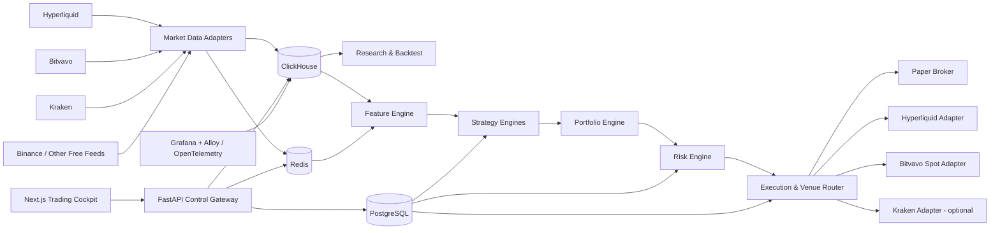
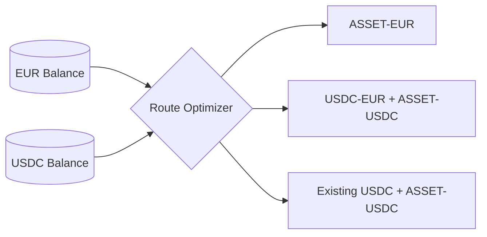
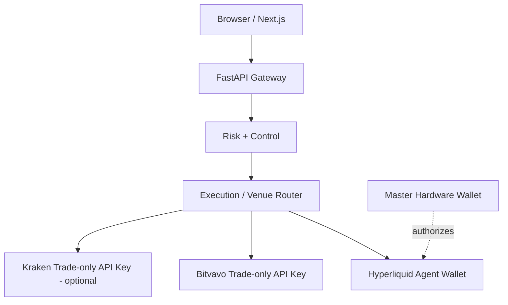

# Architecture

## Overview

The platform follows one simple venue principle:

> **Observe many venues; trade on few venues.**

The data plane may ingest multiple free public feeds, while authenticated live execution is introduced gradually and only where it has a measurable purpose.



See [Venue Strategy](VENUES.md) for the rollout policy and exchange roles.

## Separation of concerns

### Data Plane

Owns collection, timestamping, normalization, quality checks and storage. Strategy code never calls vendor-specific APIs directly.

Canonical interfaces should expose concepts such as:

```text
MarketData.price(instrument)
MarketData.orderbook(instrument)
MarketData.funding(instrument)
MarketData.open_interest(instrument)
MarketData.trades(instrument)
MarketData.venue_health(venue)
```

Initial public adapters target Hyperliquid, Bitvavo, Kraken and selected Binance feeds. Additional venues are added only where they serve a research hypothesis or resilience requirement.

### Research Plane

Runs isolated experiments and may consume significant CPU/RAM without affecting the live trading process. It contains feature research, event-driven backtesting, walk-forward validation, Monte Carlo/stress tests and an experiment registry.

Research can compare many venues without granting those venues live order permissions.

### Trading Plane

Small, deterministic and continuously available. It consists of:

- live feature calculation;
- strategy engines;
- portfolio construction;
- risk engine;
- execution/venue router;
- venue-specific execution adapters;
- account reconciliation;
- treasury and quote-asset controls.

No research job may share failure fate with the trading process.

### Control Plane

FastAPI + PostgreSQL manage configuration and lifecycle state, including:

- active strategy versions;
- allocations;
- risk limits;
- enabled data venues;
- eligible execution venues;
- per-venue permissions and allowlists;
- treasury targets for EUR/USDC;
- trading mode;
- experiment/promotion status;
- operator actions;
- audit history.

### Observability Plane

Grafana and OpenTelemetry/Grafana Alloy expose metrics, logs, traces, alerts and forensic timelines. Observability has read access to trading analytics and must not become a path to sign orders.

Every balance, signal, order, fill, fee and PnL record must include a venue and canonical instrument identifier.

## Venue-neutral domain model

Strategies produce intents, not exchange API calls.

```text
TradeIntent
├── asset
├── instrument_type
├── side
├── target exposure / risk budget
├── urgency
├── strategy_id
└── constraints
```

The execution/venue router converts an approved intent into an execution plan after evaluating:

- eligible venues and instruments;
- all-in expected fees;
- spread and expected slippage;
- quote-asset balances;
- depth and expected fill probability;
- venue health and stale-data state;
- account and counterparty concentration;
- strategy/venue allowlists;
- funding or borrow cost;
- regulatory and operational constraints.

The selected route and rejected alternatives are persisted for later execution-quality analysis.

## Quote-asset and treasury routing

EUR and USDC conversion is a treasury concern, not strategy logic.

The platform can use Bitvavo's `USDC-EUR` market to automate conversion, but it must compare the direct EUR asset route with the USDC route before trading.



Treasury policy includes:

- target/minimum/maximum EUR and USDC balances;
- per-order and daily conversion limits;
- spread/slippage guards;
- optional human approval above a threshold;
- explicit EUR/USD and stablecoin-risk reporting.

## Data stores

### ClickHouse

Use for append-heavy analytical/time-series data:

- raw and normalized trades;
- candles;
- L2 snapshots/derived depth;
- funding and OI;
- cross-venue prices and basis;
- features and predictions;
- signals;
- execution plans, fills and TCA;
- conversion orders and quote-currency attribution;
- PnL/equity snapshots;
- backtest results.

### PostgreSQL

Use for durable transactional/configuration state:

- strategy registry and versions;
- model metadata;
- risk policies;
- portfolio allocation;
- venue registry and capabilities;
- account and credential metadata without secrets;
- treasury policy;
- deployment state;
- experiment metadata;
- approvals and audit records.

### Redis

Use as a bounded realtime nervous system, not as the system of record:

- current market state;
- signal state;
- venue health;
- quote-asset balances/cache;
- order/position cache;
- lightweight streams/events.

Redis must have memory limits and persistence choices appropriate to disposable realtime state.

## Backend / frontend boundary

The browser communicates only with the FastAPI control gateway over HTTPS/WebSocket. The UI never contains exchange signing keys and never signs orders directly.



Withdrawal/funding permissions are never granted to automated Bitvavo/Kraken credentials. The Hyperliquid master wallet seed never resides on TrueNAS.

## Execution modes

All modes implement one broker/execution interface:

- `BACKTEST`
- `PAPER`
- `SHADOW`
- `TESTNET` where supported
- `LIVE`

Strategy and risk code must not branch into separate logic just because the broker or venue changes. This is central to avoiding paper/live drift.

Each live venue is promoted separately. A strategy approved for paper trading on multiple venues is not automatically approved to place live orders on those venues.

## Planned service layout

```text
apps/
  cockpit/
  api/
  collector/
  trader/
  research-worker/
quant/
  strategies/
  features/
  portfolio/
  risk/
  execution/
    router/
    adapters/
      paper/
      hyperliquid/
      bitvavo/
      kraken/
  treasury/
  backtest/
  validation/
data/
  adapters/
    hyperliquid/
    bitvavo/
    kraken/
    binance/
  schemas/
  instruments/
infra/
  docker/
  clickhouse/
  postgres/
  redis/
  grafana/
  alloy/
```

## Performance philosophy

Python is the default trading/research language because the first strategies operate over seconds-to-days rather than microseconds. If profiling later proves a latency-sensitive path has meaningful economic value, that isolated collector/execution component may be replaced with Rust without changing strategy APIs.

## Reliability requirements

The production execution path must eventually support:

- deterministic client order IDs;
- idempotent order submission handling;
- partial fills;
- cancel/replace state machines;
- per-venue precision/minimum-order validation;
- stale-data and venue-health guards;
- reconnect + resubscription;
- periodic balance/order/position reconciliation per venue;
- persisted execution and conversion ledger;
- startup recovery;
- maximum spread/slippage guards;
- per-venue and platform-wide halt controls;
- dead-man/cancel-all protection where supported;
- explicit counterparty/venue concentration limits;
- separate exchange credentials with minimum permissions;
- dedicated Hyperliquid agent wallet(s) separate from the master wallet.
