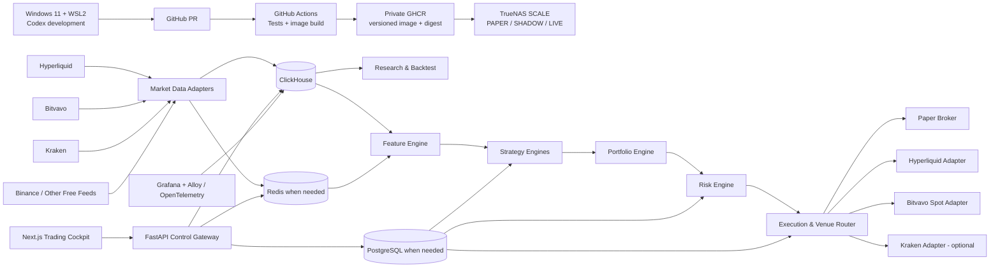
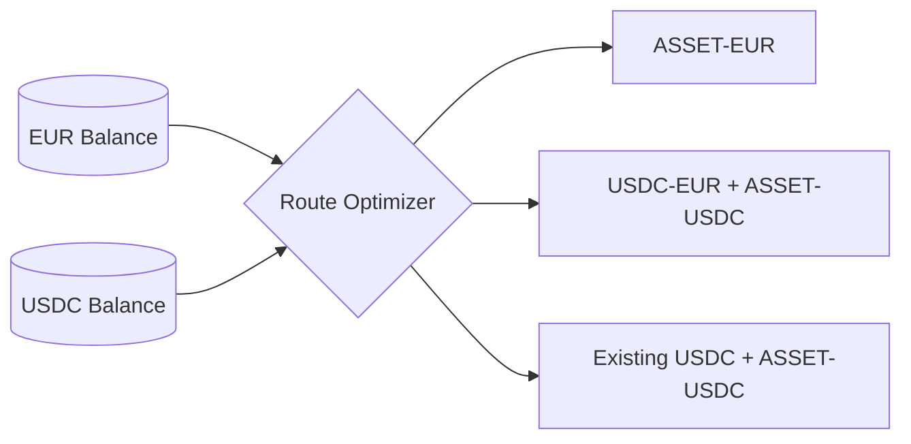
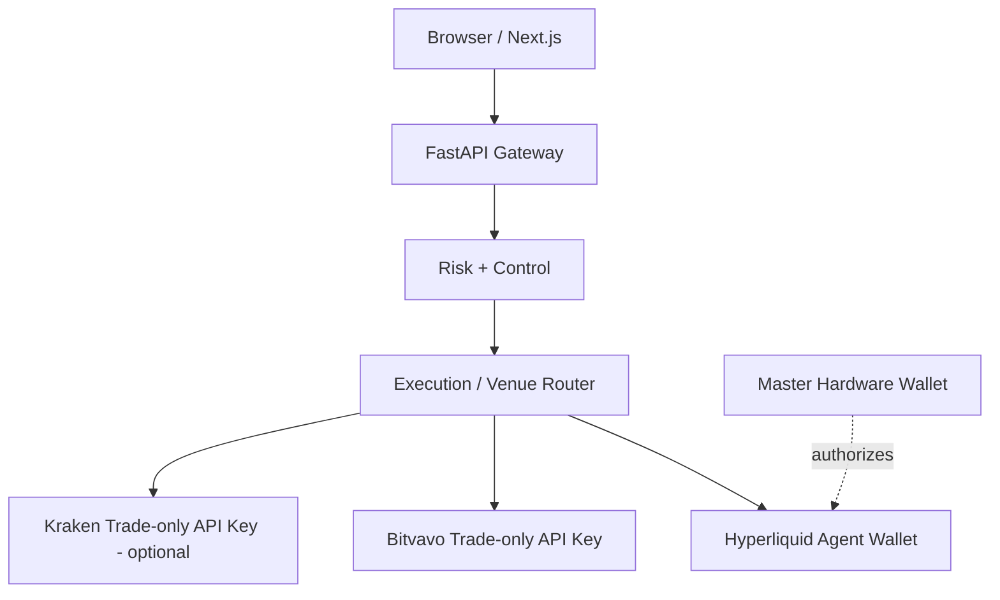

# Architecture

## Overview

The platform follows two governing principles:

> **Observe many venues; trade on few venues.**

> **Develop away from the 24/7 runtime; deploy tested immutable artifacts.**

The data plane may ingest multiple free public feeds, while authenticated execution is introduced gradually and only where it has a measurable purpose. Source development happens on Windows 11 through WSL2 and Codex. TrueNAS runs pinned Linux container images for persistent data collection, paper trading, observability and eventual live execution.



See [Development Workflow](DEVELOPMENT.md), [Deployment](DEPLOYMENT.md), and [Venue Strategy](VENUES.md).

## Environment separation

### DEV — Windows 11 + WSL2

Owns:

- source code;
- Codex-driven implementation;
- unit tests;
- local disposable integration services;
- small deterministic datasets and replay fixtures;
- frontend development;
- small/medium research experiments.

DEV does not own 24/7 state and does not contain production trading credentials.

### CI — GitHub Actions

Owns independent verification and release construction:

- lint/type/test checks;
- frontend production build;
- contract and safety tests;
- container build;
- secret/dependency/security checks;
- release image publication to private GHCR.

CI does not directly promote a strategy into live capital.

### PAPER / SHADOW / LIVE — TrueNAS

Owns:

- continuous market-data collection;
- durable ClickHouse data;
- paper/shadow/live strategy processes;
- operational state;
- Grafana and production cockpit;
- runtime secrets;
- monitoring, alerts, recovery and backups.

These are separately configured deployments. Source code is never edited in place inside the running TrueNAS containers.

## Separation of concerns

### Data Plane

Owns collection, timestamping, normalization, quality checks and storage. Strategy code never calls vendor-specific APIs directly.

Canonical interfaces should expose concepts such as:

```text
MarketData.price(instrument)
MarketData.orderbook(instrument)
MarketData.funding(instrument)
MarketData.open_interest(instrument)
MarketData.trades(instrument)
MarketData.venue_health(venue)
```

Initial public adapters target Hyperliquid, Bitvavo, Kraken and selected Binance feeds. Additional venues are added only where they serve a research hypothesis or resilience requirement.

The local development data plane uses mocks, fixtures and disposable services. The TrueNAS data plane is authoritative for self-collected 24/7 history.

#### Dormant provenance spine and atomic v3 cutover

Phase 1A-3B1A defines pure, frozen contracts for feed products, collection/subscription identity,
raw application-message records, point-in-time instrument metadata, explicit coverage, event
families and a provenance-complete `MarketEventEnvelopeV3`. These v3 contracts are defined and
tested but dormant. Their import direction is
`contracts.py <- data_provenance.py <- instrument_metadata.py <- market_event_v3.py`. No runtime
producer constructs or emits `MarketEventEnvelopeV3`, and schema v2 remains the only active Silver
envelope.

The eventual storage-neutral responsibilities are:

- Bronze preserves exact post-extension, reassembled application-message bytes and immutable
  capture lineage without requiring successful decoding;
- Silver contains validated venue-neutral event families with Bronze observation lineage, source
  provenance, resolved point-in-time metadata and ingress/normalization coverage;
- Gold contains reproducible point-in-time features and aggregates derived from identified Silver
  inputs.

Phase 1A-3B1B activates this Bronze boundary only in the Hyperliquid public-trades collector.
Every application message successfully returned by `recv()` is represented once with exact TEXT
or BINARY application-message bytes and accepted by a mandatory bounded `RawRecordSink` before
routing or parsing. A separate mandatory bounded `NormalizationOutcomeSink` then accepts exactly
one frame decision before acknowledgement, pong, deduplication, ordinary message counters or the
existing v2 queue can become visible. The raw-acceptance counter advances immediately after the raw
acceptance echo is verified; the outcome-acceptance counter advances independently after its echo
is verified, with `outcome <= raw` at all times. Those two telemetry mutations are the only state
changes allowed at their respective pre-commit boundaries. Acceptance transfers ownership of the
complete immutable value at the sink boundary; it is not a durability claim. The collector owns
the two distinct sinks for one run and closes the outcome sink before the raw sink, with both
closes bounded and attempted at most once.

Internal constructor and sink exceptions and their traceback frames remain private implementation
details. Standalone module-level producer and consumer coroutine boundaries catch and classify
private failures, release the payload-bearing coroutine graph, and only then create a fresh bounded
public error. Their library traceback frames therefore retain no collector, connection, sink,
queue or payload-bearing state; nothing logs or retains `exc_info`. A sink deadline is a collector
fail-stop decision that does not await child-cancellation completion. A late result is invalid,
ignored and privately consumed. In-process sinks must nevertheless cooperate with cancellation:
Python cannot forcibly terminate hostile coroutine code, so an absolute kill boundary requires a
future isolated worker or process. There is still no concrete storage, operational coverage
tracker, `DeliveryOutcome` or deterministic replay. A normalization outcome may therefore be
committed even when later v2 queue publication times out; Phase 1A-3B1C adds the separate delivery
boundary and coverage transitions. Only 3B1D atomically moves both normalizers and the collector
to the mandatory v3 envelope and removes outer v2 plus `is_gap`. No dual writer or permanent v2
wrapper is planned. Nothing is deployed, and SHADOW/LIVE remain disabled. ADR-022 records the
complete decision and canonical identity rules.

### Research Plane

Runs isolated experiments and may consume significant CPU/RAM without affecting the continuous trading/data path. It contains feature research, event-driven backtesting, walk-forward validation, Monte Carlo/stress tests and an experiment registry.

Research may run:

- locally in WSL2 against bounded sample data;
- in CI for deterministic regression tests;
- as a controlled low-priority TrueNAS research worker against larger datasets.

Research can compare many venues without granting those venues live order permissions.

### Trading Plane

Small, deterministic and continuously available. It consists of:

- live feature calculation;
- strategy engines;
- portfolio construction;
- risk engine;
- execution/venue router;
- venue-specific execution adapters;
- account reconciliation;
- treasury and quote-asset controls.

No research job or development tool may share failure fate with the trading process.

### Control Plane

FastAPI and, when required, PostgreSQL manage configuration and lifecycle state, including:

- active strategy versions;
- allocations;
- risk limits;
- enabled data venues;
- eligible execution venues;
- per-venue permissions and allowlists;
- treasury targets for EUR/USDC;
- trading mode;
- experiment/promotion status;
- operator actions;
- audit history;
- deployed commit/image digest.

PostgreSQL is the planned durable transactional store, but it is not a blocker for the first local vertical slice. The initial implementation may begin with versioned configuration and explicit interfaces before introducing the service.

### Observability Plane

Grafana and OpenTelemetry/Grafana Alloy expose metrics, logs, traces, alerts and forensic timelines. Observability has read access to trading analytics and must not become a path to sign orders.

Grafana dashboard definitions are version-controlled. Grafana MCP may edit dashboards and alerts within the Hyperliquid project scope, while datasource database credentials remain read-only wherever possible.

Every balance, signal, order, fill, fee and PnL record includes a venue and canonical instrument identifier. Every deployment and trading record includes a code commit, image digest and configuration version.

### Build & Deployment Plane

The supply chain converts reviewed source into runtime artifacts:

```text
source branch
  -> pull request
  -> CI validation
  -> merge
  -> release image build
  -> private GHCR
  -> digest-pinned TrueNAS deployment
  -> health/soak gates
  -> promotion or rollback
```

The same image digest should be promoted through PAPER, SHADOW and SMALL LIVE wherever practical. Configuration and secrets change by environment; application code does not.

## Venue-neutral domain model

Strategies produce intents, not exchange API calls.

```text
TradeIntent
├── asset
├── instrument_type
├── side
├── target exposure / risk budget
├── urgency
├── strategy_id
└── constraints
```

The execution/venue router converts an approved intent into an execution plan after evaluating:

- eligible venues and instruments;
- all-in expected fees;
- spread and expected slippage;
- quote-asset balances;
- depth and expected fill probability;
- venue health and stale-data state;
- account and counterparty concentration;
- strategy/venue allowlists;
- funding or borrow cost;
- regulatory and operational constraints.

The selected route and rejected alternatives are persisted for later execution-quality analysis.

## Quote-asset and treasury routing

EUR and USDC conversion is a treasury concern, not strategy logic.

The platform can use Bitvavo's `USDC-EUR` market to automate conversion, but it must compare the direct EUR asset route with the USDC route before trading.



Treasury policy includes:

- target/minimum/maximum EUR and USDC balances;
- per-order and daily conversion limits;
- spread/slippage guards;
- optional human approval above a threshold;
- explicit EUR/USD and stablecoin-risk reporting.

## Data stores

### ClickHouse

Use for append-heavy analytical/time-series data:

- raw and normalized trades;
- candles;
- L2 snapshots/derived depth;
- funding and OI;
- cross-venue prices and basis;
- features and predictions;
- signals;
- execution plans, fills and TCA;
- conversion orders and quote-currency attribution;
- PnL/equity snapshots;
- backtest results.

A small disposable ClickHouse container is used in local development. The managed TrueNAS ClickHouse instance holds continuous paper/runtime data in a separate Hyperliquid database and with separate writer/read-only identities.

### PostgreSQL

Use for durable transactional/configuration state when the control plane requires it:

- strategy registry and versions;
- model metadata;
- risk policies;
- portfolio allocation;
- venue registry and capabilities;
- account and credential metadata without secrets;
- treasury policy;
- deployment state;
- experiment metadata;
- approvals and audit records.

### Redis

Use as a bounded realtime nervous system only when multiple services require shared low-latency state:

- current market state;
- signal state;
- venue health;
- quote-asset balances/cache;
- order/position cache;
- lightweight streams/events.

The first local slice may use bounded in-process queues. Redis is not the authoritative long-term market-data or execution ledger and is introduced only when service separation justifies it.

## Backend / frontend boundary

The browser communicates only with the FastAPI control gateway over HTTPS/WebSocket. The UI never contains exchange signing keys and never signs orders directly.



Withdrawal/funding permissions are never granted to automated Bitvavo/Kraken credentials. The Hyperliquid master wallet seed never resides on Windows, TrueNAS, Docker, GitHub or the browser.

## Execution modes

All modes implement one broker/execution interface:

- `BACKTEST`
- `PAPER`
- `SHADOW`
- `TESTNET` where supported
- `LIVE`

Strategy and risk code must not branch into separate logic just because the broker or venue changes. This is central to avoiding paper/live drift.

The source tree may contain future execution adapters, but local DEV runs fail closed to PAPER unless a separate explicitly authorized integration environment is used. Each live venue is promoted separately.

## Planned repository layout

```text
apps/
  cockpit/
  api/
  collector/
  trader/
  research-worker/
quant/
  strategies/
  features/
  portfolio/
  risk/
  execution/
    router/
    adapters/
      paper/
      hyperliquid/
      bitvavo/
      kraken/
  treasury/
  backtest/
  validation/
data/
  adapters/
    hyperliquid/
    bitvavo/
    kraken/
    binance/
  schemas/
  instruments/
infra/
  dev/
  images/
  truenas/
  clickhouse/
  postgres/
  redis/
  grafana/
  alloy/
```

## Performance philosophy

Python is the default trading/research language because the first strategies operate over seconds-to-days rather than microseconds. If profiling later proves a latency-sensitive path has meaningful economic value, that isolated collector/execution component may be replaced with Rust without changing strategy APIs.

The Windows RTX GPU may support later model experiments, but the first strategy and execution path must not depend on a GPU.

## Reliability requirements

The production execution path must eventually support:

- deterministic client order IDs;
- idempotent order submission handling;
- partial fills;
- cancel/replace state machines;
- per-venue precision/minimum-order validation;
- stale-data and venue-health guards;
- reconnect + resubscription;
- periodic balance/order/position reconciliation per venue;
- persisted execution and conversion ledger;
- startup recovery;
- maximum spread/slippage guards;
- per-venue and platform-wide halt controls;
- dead-man/cancel-all protection where supported;
- explicit counterparty/venue concentration limits;
- separate exchange credentials with minimum permissions;
- dedicated Hyperliquid agent wallet(s) separate from the master wallet;
- versioned image deployment with health checks and tested rollback;
- no runtime dependency on the Windows development machine.
